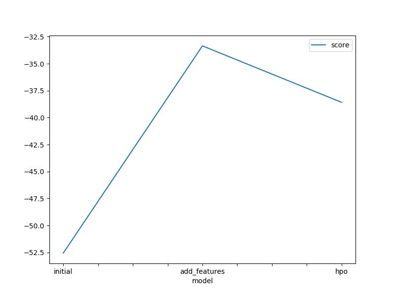
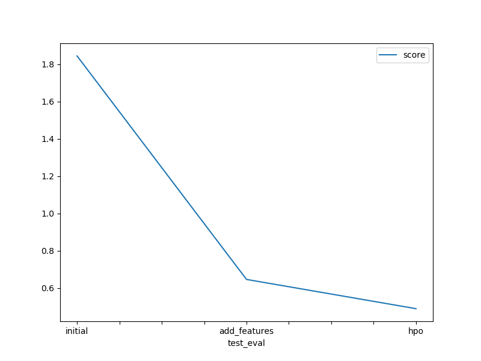

# Predict Bike Sharing Demand with AutoGluon
#### Ahmad Hassan

## Results and Conclusion

### Initial Training
- The top-ranked model that performed well was the "WeightedEnsemble_L3" model without hyperparameter tuning.

### Exploratory Data Analysis and Feature Creation
- Additional features were created by extracting the hour, day, month, and year from the DateTime feature.
- Some features were converted to categorical variables.
- The models' performance did not significantly improve after adding these additional features.

### Hyperparameter Tuning
- Hyperparameter tuning did not result in improved model performance and, in some cases, decreased the performance.

### Future Considerations
- If given more time with this dataset, more focus would be given to creating synthetic features.

### Model Comparison and Kaggle Scores
- A table was created to compare the models, the hyperparameters modified, and the Kaggle scores. The top-performing model was the "WeightedEnsemble_L3" with a Kaggle score of 1.84484.

### Training and Kaggle Scores

### Prediction Submissions

## Summary
The project aimed to predict bike rental demand for a rental company using the AutoGluon solution. The ML life cycle involved problem understanding, data manipulation, feature engineering, model building, and testing. The objective was to increase company profitability and customer satisfaction by accurately predicting the number of bike trips needed.

During the initial training, it was observed that negative predictions (-) were not allowed for submission, so they were adjusted to 0. The top-ranked model was the "WeightedEnsemble_L3" without hyperparameter tuning.

Exploratory data analysis revealed insights that helped in adding additional features. Hour, day, month, and year features were extracted from the DateTime feature, and certain variables were converted to categorical. However, the model performance did not improve significantly after adding these features.

Hyperparameter tuning was performed, but it did not lead to improved performance and, in some cases, resulted in decreased performance.

Given more time with the dataset, the focus would be on creating more synthetic features to enhance the models' predictive power.

The project involved multiple model runs with different hyperparameters, and a table was created to summarize the models, hyperparameters, and corresponding Kaggle scores.

The project's findings and results were visualized through line plots showcasing the top model score during training runs and the top Kaggle scores during prediction submissions.

Overall, the project provided valuable insights into predicting bike rental demand and highlighted the importance of feature engineering, model selection, and hyperparameter tuning for achieving accurate predictions.
